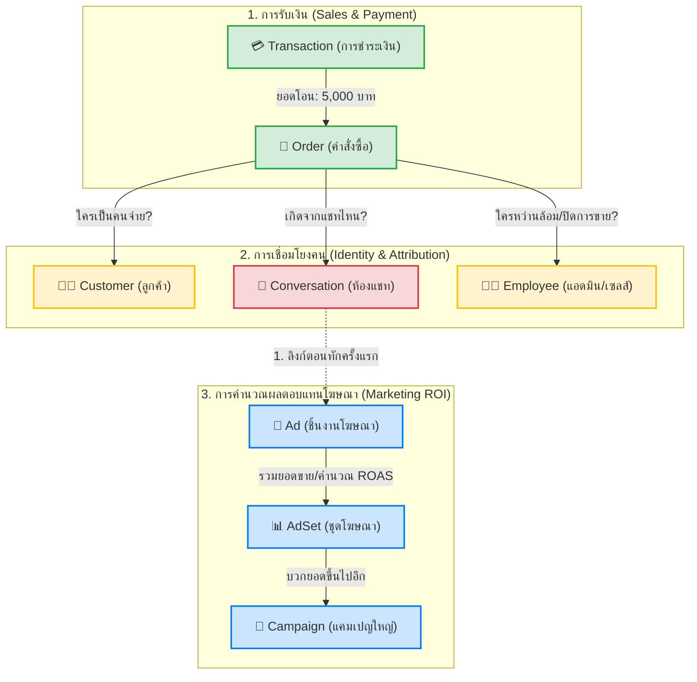

# V School CRM - Sales Attribution Tree (แผนภูมิต้นไม้การคำนวณยอดขาย)

**วันที่อัปเดต:** 2026-03-03
**อ้างอิง:** โครงสร้าง Database (`schema.prisma`) และระบบทำ Attribution

เอกสารนี้แสดงการไหลของข้อมูล (Data Flow) และแผนภูมิต้นไม้ ว่ายอดเงิน 1 ก้อนที่ลูกค้าโอนมา ถูกส่งกลับขึ้นไปคำนวณเป็นยอด ROAS (Return on Ad Spend) ของแคมเปญโฆษณาตามลำดับชั้นอย่างไร

## ลำดับขั้นการคำนวณ (Calculation Tree) ตัวอย่างเช่น:

สมมติยอดโอนเข้ามา **15,000 บาท** สำหรับคอร์ส Shabu Master:

1. **รากต้นไม้ (Root): `Transaction` -> `Order`**
   - มีสลิปยอด 15,000 บาท (`Transaction`)
   - นำไปบวกเป็นรายได้ของ `Order` บิลนี้ ทำให้สถานะบิลเป็น `PAID`

2. **ลำต้น (Trunk): `Order` -> `Customer` & `Employee`**
   - แบ่งเป็น KPI ให้แอดมินคุณ **ฟ้า (Fah)** ที่รหัสพนักงาน `TVS-EMP-001` (ปิดการขาย)
   - เป็นประวัติการสั่งซื้อของนาย **A (ลูกค้า)** รหัส `TVS-CUS-001`

3. **กิ่งก้าน (Branch): `Conversation` -> `Ad`**
   - ระบบเช็คว่าตอนที่นาย A ทักเข้ามาในห้องแชท (`Conversation`) ครั้งแรกสุด เขามาจากโฆษณารหัสไหน
   - พบว่ามาจาก **`Ad`: "วิดีโอชาบูเนื้อ A5"`** (ใช้เงินค่าแอดเปิดตัว 500 บาท)
   - คำนวณเบื้องต้นที่ `Ad`: **เงินเข้า 15,000 / ใช้เงินไป 500 = ROAS นำส่งคือ 30x**

4. **ยอดไม้ (Canopy): `Ad` -> `AdSet` -> `Campaign`**
   - เงิน 15,000 ถูกบวกนำส่งให้ **`AdSet`: "คนชอบกินชาบูกรุงเทพ"`**
   - ก่อนจะถูกรวบยอดทั้งหมดขึ้นไปที่ **`Campaign`: "โปรโมทหลักสูตร Q1/2026"`**
   - ผู้บริหารจะเห็นตัวเลขรวม 15,000 ปรากฏในรายงานว่า แคมเปญหลักสูตร Q1 หาเงินได้จากการโฆษณาส่วนนี้

---

> 💡 **หมายเหตุทางเทคนิค (สำหรับ Dev):** 
> ปัจจุบันระบบเชื่อมจากด้านบนไปถึง `Message / Order` เรียบร้อยแล้ว (REQ-01 ถึง 03) ส่วนรอยต่อระหว่าง `Conversation` กลับไปยัง `Ad` เพื่อให้เกิด Tree ด้านบนนี้ได้อย่างไร้รอยต่อ 100% จะเป็นงานในส่วนของ **REQ-07 (Conversation First Touch AdId)** ครับ
