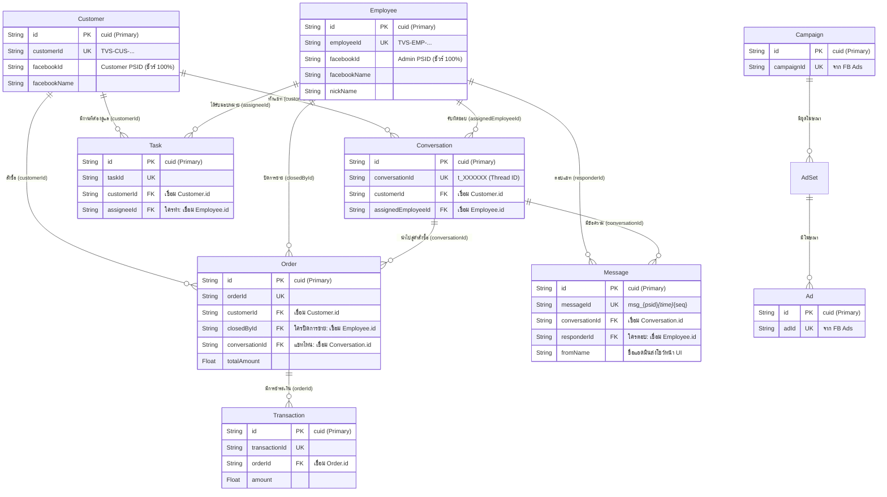

# V School CRM - Entity Relationship Diagram (ERD)

**วันที่อัปเดต:** 2026-03-03  
**อ้างอิง:** `prisma/schema.prisma` และ `docs/id-mapping.yaml`

นี่คือแผนภาพแสดงความสัมพันธ์ของข้อมูล (ERD) ฉบับล่าสุดในระบบ CRM ซึ่งรวมเอาการเชื่อมโยง (Mapping) ที่แม่นยำที่สุดผ่าน Primary Key (`cuid`) และ Foreign Keys (FK) แบบ 100%

## สรุปจุดสำคัญของโครงสร้าง (Key Architectural Changes)

1. **`Employee` เป็นศูนย์กลางของการปฏิบัติงานทั้งหมด:**
   - การกระทำทั้งหมด ไม่ว่าจะเป็น **"ใครตอบแชท" (`Message.responderId`)**, **"ใครดูแลลูกค้าคนนี้" (`Conversation.assignedEmployeeId`)** หรือ **"ใครปิดการขาย" (`Order.closedById`)** ล้วนชี้ตรงกลับมาที่ `Employee.id` (cuid) ของตาราง Employee การวัดผล KPI และค่าคอมมิชชันจึงถูกต้องที่สุด 100%
2. **เลิกใช้การยึดโยงด้วยชื่อ (String Match):**
   - แม้ Field อย่าง `fromName` หรือ `assignedAgent` จะยังเก็บอยู่ แต่ออกแบบมาเพื่อแสดงผลบนหน้าจอให้มนุษย์อ่านง่ายๆ เท่านั้น (Human-readable) ในขณะที่ฐานข้อมูลหลังบ้านและการคำนวณเงินอ้างอิงจาก FK ทั้งหมด
3. **`facebookId` (PSID) แบบเจาะจง:**
   - ทั้ง `Customer` และ `Employee` มี `facebookId` ซึ่งเป็น Page-Scoped ID (PSID) ป้องกันปัญหากรณีลูกค้าหรือแอดมินเปลี่ยนชื่อเฟสบุ๊ก
4. **Attribution Chain ที่สมบูรณ์:**
   - สายเชื่อมโยง `Conversation` -> `Order` -> `Transaction` ทำให้ระบบตอบได้ชัดเจนว่า "สลิปโอนเงินใบนี้ มาจากออเดอร์ไหน และออเดอร์นี้เกิดจากการปิดการขายในห้องแชทไหน และใครเป็นผู้ตอบในเวลานั้น"
