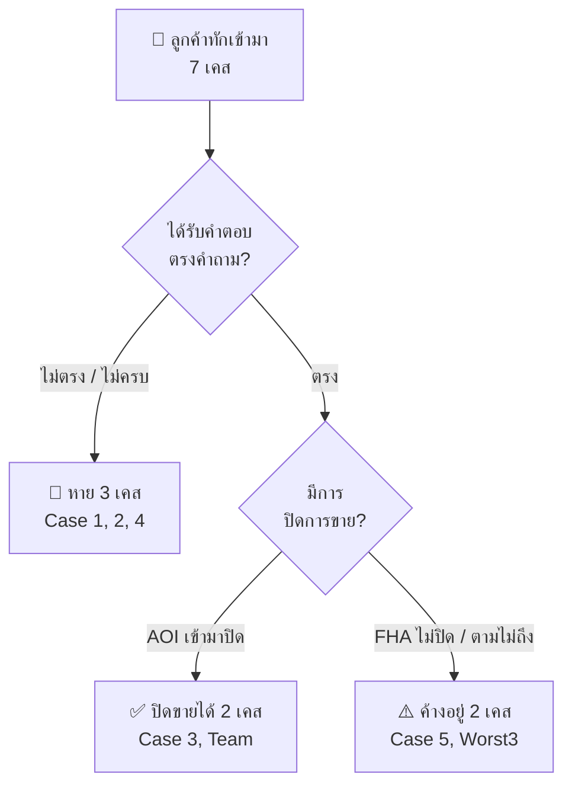

# 📊 รายงานวิเคราะห์คุณภาพการตอบแชท: แอดมินฟ้า [FHA]
### The V School — สถาบันสอนทำอาหารญี่ปุ่น
> **วันที่วิเคราะห์:** 6 มีนาคม 2026  
> **ข้อมูลที่วิเคราะห์:** 5 Root Cases + 1 Team Case + 3 Worst Cases  
> **ช่วงเวลาข้อมูล:** 22 กุมภาพันธ์ – 8 มีนาคม 2026

---

## 1. 📈 ตัวเลขดิบ (Raw Numbers)

### 1.1 สรุปข้อความ

| เมตริก | ค่า |
|---|---|
| จำนวนแชทที่วิเคราะห์ (FHA ดูแล) | 7 แชท (5 Root + 1 Team + 1 Worst) |
| ข้อความจากฟ้า (FHA) ทั้งหมด | ~28 ข้อความ |
| ข้อความจากอ้อย (AOI) เข้ามาช่วย | ~8 ข้อความ (2 เคส) |
| อัตราการปิดการขาย (FHA เป็นคนปิดเอง) | **0/5 Root Cases (0%)** |
| อัตราการปิดการขาย (ที่ FHA เกี่ยวข้อง) | 2/7 (29%) — แต่ทั้ง 2 เคสต้องพึ่ง AOI |

### 1.2 การกระจายเวลาตอบ (Response Time Distribution)

| ช่วงเวลา | จำนวนครั้ง | ตัวอย่าง |
|---|---|---|
| **< 5 นาที** | 3 | Case 1: ตอบใน 3 นาที, Case 3: ตอบใน ~5 นาที |
| **5–30 นาที** | 3 | Team Case: ตอบใน 14 นาที, Case 3: 10 นาที |
| **30–60 นาที** | 0 | — |
| **1–4 ชั่วโมง** | 2 | Case 2: `02:32→06:52` (4 ชม. 20 นาที — ยามดึกจึงยอมรับได้) |
| **> 4 ชั่วโมง** | 2 | Case 5: ลูกค้าขอรูป `10:50`→ได้รูป `15:55 (3 วันถัดมา!)`, Worst Case 1: `09:47→15:20` (5 ชม. 33 นาที ในเวลาทำการ) |

> [!WARNING]
> **Case 5:** ลูกค้าขอรูปเผือกทอดวันที่ 4 มี.ค. เวลา 10:50 น. แต่ได้รับรูปวันที่ **7 มี.ค. เวลา 15:55 น.** (ห่าง **3 วัน**) — สร้างความรู้สึก "ไม่ใส่ใจ" อย่างรุนแรง

### 1.3 คำติดปาก (Signature Phrases)

| คำ/วลี | ความถี่ | ปัญหา |
|---|---|---|
| `"คะ"` / `"ค่ะ"` ท้ายประโยค | ทุกข้อความ | ปกติ ไม่มีปัญหา |
| `"สนใจลงรอบนี้ไหมคะ"` | ≥4 ครั้ง | **ใช้ซ้ำหนักมาก** — กลายเป็น Template ปิดการขายเดียวที่มี |
| `"น้องอายุเท่าไรคะ / น้องปิดเทอมเมื่อไรคะ"` | ≥3 ครั้ง | **ถามข้อมูลซ้ำ** แม้ลูกค้าบอกไปแล้ว (Case 2 & 4) |
| `"ขออภัยไม่ได้สอนค่ะลูกค้า"` | 1 ครั้ง | ใช้คำว่า "ลูกค้า" แทนการเรียกชื่อ — ห่างเหิน |
| `"😁😁😁"` | 1 ครั้ง | พยายามแสดงความเป็นกันเอง แต่อยู่ผิดจังหวะ |

### 1.4 ใครส่งข้อความสุดท้าย

| เคส | ข้อความสุดท้ายส่งโดย | สถานะ |
|---|---|---|
| Root Case 1 | **Admin** (ปฏิเสธ) | ❌ ลูกค้าเงียบหายเพราะถูกปิดโอกาส |
| Root Case 2 | **Admin** (ถามเรื่องอื่น) | ❌ ลูกค้าไม่เคยได้คำตอบเรื่องราคา |
| Root Case 3 | **Customer** (ตัดสินใจลง) | ✅ แต่เป็นผลงาน AOI |
| Root Case 4 | **Admin** (ส่งตาราง) | ⚠️ ลูกค้าเปิดอ่านแต่ไม่ตอบ |
| Root Case 5 | **Admin** (ส่งรูป) | ⚠️ ลูกค้าอ่านแต่ไม่ตอบ |
| Team Case | **Customer** (ขอบคุณ) | ✅ ปิดขายสำเร็จ (FHA + AOI ร่วมมือ) |

**สรุป:** Admin ส่งข้อความสุดท้าย **67%** vs Customer **33%** — แต่ข้อความสุดท้ายของ Admin มักเป็น "Dead-end message" ที่ไม่ได้เปิดทางให้ลูกค้าตอบต่อ

---

## 2. 🔍 Dropout Funnel Analysis



### รายละเอียดแต่ละจุดหลุด

#### 🔴 หลุดหลังถูกปฏิเสธ (1 เคส)
> **Root Case 1 — Jee Bee:**  
> ลูกค้าถาม: `"สนใจเรียนสูตรแฮมเบอร์เกอร์ อาหารยุโรปราคาเท่าไรค่ะ"`  
> ฟ้าตอบ: `"สถาบันเราสอนอาหารญี่ปุ่น ติ่มซำ อาหารเกาหลีคะ"` + `"ขออภัยไม่ได้สอนค่ะลูกค้า"`  
> 
> **สิ่งที่หายไป:** ไม่มีการ Redirect — ลูกค้าที่สนใจเรียนทำอาหาร **มีศักยภาพเป็นลูกค้าคอร์สอื่น** เช่น คอร์สอิซากาย่า (มีเมนู Western-influenced) หรือแม้แต่ Basic Japanese เพื่อเปิดร้านฟิวชัน  
> **มูลค่าที่สูญเสีย:** ≈ 9,900–32,800 บาท (คอร์สพื้นฐานถึง Package)

#### 🔴 หลุดหลังไม่ได้คำตอบเรื่องราคา (1 เคส)
> **Root Case 2 — Sampiar Victoria Van Niekerk:**  
> ลูกค้าถาม: `"ขอทราบราคาค่ะ"` + `"9ขวบค่ะ"`  
> ฟ้าตอบ: ส่งตารางเรียน, ถาม `"น้องอายุเท่าไรคะ"` (ลูกค้าบอกอายุไปแล้ว!), `"น้องปิดเทอมเมื่อไรคะ"`  
>
> **ลูกค้าไม่เคยได้รู้ราคา** (เรียนรวม 5 วัน Kids Camp ราคาเท่าไร?) → ลูกค้าเงียบหาย  
> **ความผิดพลาดซ้อน:** ถามอายุทั้งที่ลูกค้าบอก "9 ขวบ" ไปแล้ว — แสดงว่า **ไม่ได้อ่านข้อความ** หรือ **ใช้ Template แบบ Copy-Paste**  
> **มูลค่าที่สูญเสีย:** ≈ ค่าแคมป์เด็ก (ประมาณ 5,000–8,000 บาท/สัปดาห์)

#### 🟡 หลุดหลังไม่ได้รับข้อมูลทันเวลา (1 เคส)
> **Root Case 4 — Satathanut Khamjing:**  
> ลูกค้าถาม: `"ราคาเท่าไรครับ"` → ฟ้าตอบตารางแต่ **ไม่ได้บอกราคา** (อีกแล้ว!)  
> ลูกค้าบอก: `"May"` (ปิดเทอมพฤษภาคม สำหรับเด็ก 2 คน อายุ 8 และ 11)  
> ฟ้าตอบ: `"ตารางเดือนmayกำลังทำอยู่นะคะ"` → Follow-up 7 วันหลัง: `"เรียนวันที่11-15/5 ตารางเมนูกำลังทำคะ"`  
>
> **ดี:** มีการ Follow-up — แต่ยังคงไม่บอกราคา, ไม่ขอเบอร์โทร, ไม่ส่งโปรโมชัน  
> **มูลค่าที่สูญเสีย:** ≈ 10,000–16,000 บาท (เด็ก 2 คน × ค่าแคมป์)

#### 🟡 ค้างอยู่แต่ไม่ถึงการปิดขาย (1 เคส)
> **Root Case 5 — Awika Beam:**  
> ลูกค้า: `"สนใจคร่า แต่เด๋วต้องไปขออนุมัติก่อน 555"` ← **Buying Signal ชัดเจน!**  
> ฟ้าตอบวันถัดมาด้วยโปรโมชัน (ดีแล้ว) แต่:
> 1. ลูกค้าขอรูปเผือกทอด → ส่งรูปช้า **3 วัน**  
> 2. ลูกค้าถาม `"ซาลาเปาอบ เต็มไปหรือยังค้าาา"` → ลูกค้าจะลง → แต่ไม่ได้ปิดขาย  
> 3. ลูกค้าถาม `"คอร์สนี้ได้แค่ 2 เมนูใช่ไหมคะ"` → ฟ้าส่งรูป ไม่ตอบคำถาม  

---

## 3. 🤖 แพทเทิร์นการสื่อสาร

### 3.1 Robotic Pattern Score: **7/10** (ค่อนข้างเป็นหุ่นยนต์)

| ตัวชี้วัด | คะแนน | หลักฐาน |
|---|---|---|
| Template Dependency | 🔴 8/10 | ใช้ข้อความ `"Season 1 16-20/3 เรียน9.00-16.00น."` ซ้ำแทบทุกเคส (Case 2, 3, 4) แม้ลูกค้าไม่ได้ถาม |
| ปรับตามบริบท | 🔴 3/10 | Case 2: ลูกค้าบอก "9 ขวบ" → ฟ้ากลับถาม "น้องอายุเท่าไร" |
| ความหลากหลายของคำตอบ | 🟡 4/10 | ทุกเคสลงท้ายด้วย `"สนใจลงรอบนี้ไหมคะ"` |
| ความเป็นธรรมชาติ | 🟡 5/10 | บางทีภาษาดูเป็นธรรมชาติ (Case 5: `"😁😁😁"`) แต่ timing ผิด |

### 3.2 Template Dependency — แพทเทิร์นที่ชัดเจน

```
┌─────────────────────────────────────────────────────────────┐
│  TEMPLATE LOOP ของแอดมินฟ้า (ทุกเคส)                        │
│                                                              │
│  1. รับคำถาม                                                 │
│  2. ส่งตาราง Season 1/2  ← (แม้ลูกค้าไม่ได้ถาม)            │
│  3. ถาม "น้องอายุเท่าไร" ← (แม้ลูกค้าบอกแล้ว)             │
│  4. ถาม "น้องปิดเทอมเมื่อไร"                                │
│  5. "สนใจลงรอบนี้ไหมคะ"                                     │
│  6. 🔚 จบ — ไม่มีการตาม / ไม่บอกราคา / ไม่ขอเบอร์          │
└─────────────────────────────────────────────────────────────┘
```

### 3.3 ภาษาและการสะกด

| ประเด็น | ตัวอย่าง | ระดับ |
|---|---|---|
| สะกดถูกต้อง | ส่วนใหญ่ถูก | 🟢 ดี |
| ระดับภาษา | สุภาพ ลูกค้าระดับพอดี ("คะ", "ค่ะ") | 🟢 ดี |
| การใช้ Emoji | น้อยเกินไป ยกเว้น Case 5 (`😁😁😁`) | 🟡 ปรับปรุงได้ |
| Personalization | **ไม่เรียกชื่อลูกค้าเลย** ยกเว้น Case 3 ที่ใช้ "คุณแม่" | 🔴 วิกฤต |

> [!CAUTION]
> **Case 1:** ใช้คำว่า `"ลูกค้า"` — `"ขออภัยไม่ได้สอนค่ะลูกค้า"` → ฟังดูเหมือนร้านค้าปลีก ไม่ใช่สถาบันการศึกษา  
> **เทียบกับ ADM อ้อย (AOI):** อ้อยเรียกว่า `"คุณแม่"` ตลอด และอธิบายละเอียดพร้อมราคา — ความแตกต่างเห็นชัดมาก

---

## 4. 🧠 Marketing Psychology Scorecard

| หลักการ | เกรด | รายละเอียด |
|---|---|---|
| **Reciprocity** (ให้สิ่งที่เกินความคาดหวัง) | **D** | Case 5: ส่งโปรฟรีคอร์สซูชิ 1,990 บาท ← ดี แต่เป็นกรณีเดียว; Case 1: ปฏิเสธโดยไม่ให้อะไรตอบแทนเลย |
| **Urgency/Scarcity** (สร้างความเร่งด่วน) | **C-** | Team Case: `"ยังได้อยู่ได้คะ สะดวกโอนวันนี้ไหมคะ"` ← มี urgency เบาๆ; Case 5: `"เรียนวันที่10/3 คะ"` ← implied urgency แต่ไม่ได้บอกว่าที่เหลือน้อย |
| **Social Proof** (อ้างอิงรีวิว/ผลงาน) | **F** | ไม่มีแม้แต่ครั้งเดียวในทุกเคส — ไม่เคยพูดถึงรีวิว, จำนวนผู้เรียน, ผลงานศิษย์เก่า, หรือรูปบรรยากาศห้องเรียน |
| **Rapport Building** (สร้างสายสัมพันธ์) | **D+** | Case 3: เรียก "คุณแม่" (ดี); แต่ Case 1: เรียก "ลูกค้า" (แย่); Case 2: ไม่แสดงความสนใจว่าลูกค้าเป็นชาวต่างชาติ |
| **Follow-up** (ตามลูกค้าเงียบหาย) | **C** | Case 4: ตามกลับใน 7 วัน (ดี); Case 5: พยายามตามด้วยโปร (ดี); แต่ Case 1, 2: ไม่มี Follow-up เลย |
| **Anchoring** (เทคนิคราคา) | **F** | ไม่เคยใช้ Price Anchoring — ไม่เคยเปรียบเทียบมูลค่า, ไม่เคยแสดง "ราคาปกติ vs ราคาพิเศษ", Team Case โปร 7,200 บาทฟรี ← ดีแต่ AOI เป็นคนส่งรายละเอียดราคา |
| **Consistency Binding** (มัดจำความรู้สึก) | **F** | ไม่เคยใช้เทคนิค micro-commitment เช่น "ถ้าพี่สะดวกจองที่ไว้ก่อน ยังไม่ต้องโอนก็ได้นะคะ" — กระโดดจาก "ให้ข้อมูล" ไปที่ "โอนเลยได้ไหมคะ" ทันที |

**เกรดเฉลี่ย: D-** (ต่ำกว่ามาตรฐาน — ใช้เทคนิคน้อยมาก เน้นส่ง Info → ถามปิดขาย โดยไม่มีกลยุทธ์ตรงกลาง)

---

## 5. 🔥 การรับรู้อารมณ์และเจตนาลูกค้า (Emotional & Intent Detection)

### 5.1 เมื่อลูกค้ากังวล → แอดมินตอบด้วยความเห็นอกเห็นใจหรือแค่ Fact?

| | รายละเอียด |
|---|---|
| **สถานการณ์** | **Case 5** — Awika Beam: `"พรุ่งนี้คิวหาหมอฉ่ำมากเลยค่ะ อาจจะต้องรอบหน้า"` |
| **AI อ่านอารมณ์ได้ว่า** | ลูกค้ากำลังบอกว่า **ไม่สะดวกตอนนี้** เพราะมีภาระสุขภาพ + ต้อง "ขออนุมัติ" (อาจหมายถึงขออนุมัติค่าใช้จ่ายจากครอบครัว) — เป็นสัญญาณ "want but can't right now" |
| **ฟ้าตอบอย่างไร** | วันถัดมาส่งโปรตรงๆ: `"วันนี้มีโปรพิเศษสำหรับคุณโดยเฉพาะค่ะ หากตัดสินใจสมัครคอร์สเรียน ภายในวันนี้ 🎁 รับฟรี!"` |
| **ปัญหา** | ❌ กดดัน "ภายในวันนี้" ทั้งที่ลูกค้าเพิ่งบอกว่าไม่สะดวก — ไม่มีการแสดงความห่วงใยเลย |
| **ควรตอบอย่างไร** | `"หายป่วยก่อนนะคะพี่บีม 🙏 ไม่ต้องรีบนะคะ พอพี่สะดวกเมื่อไร ทักมาบอกนะคะ แอดจองที่ไว้ให้ก่อนค่ะ"` + 3 วันหลังทักถามสุขภาพก่อน แล้วค่อยส่งโปร |

### 5.2 เมื่อลูกค้าให้ข้อมูลโดยไม่ต้องถาม → แอดมินจับ Buying Signal ได้หรือไม่?

| | รายละเอียด |
|---|---|
| **สถานการณ์** | **Case 2** — Sampiar Victoria Van Niekerk: `"ขอทราบราคาค่ะ"` + `"9ขวบค่ะ"` |
| **AI อ่านอารมณ์ได้ว่า** | ลูกค้าให้ข้อมูลอายุเด็กโดยไม่ต้องถาม = **Buying Signal ระดับสูง** ลูกค้าพร้อมตัดสินใจ ต้องการแค่ราคาเพื่อยืนยัน |
| **ฟ้าตอบอย่างไร** | ส่งตารางเรียน → แล้วถามกลับ `"น้องอายุเท่าไรคะ"` (!) → `"น้องปิดเทอมเมื่อไรคะ"` |
| **ปัญหา** | ❌ ไม่ได้อ่านข้อความลูกค้า + ไม่ได้ตอบคำถาม "ราคา" เลย — ลูกค้ารอคำตอบไม่ได้ → เงียบหาย |
| **ควรตอบอย่างไร** | `"น้อง 9 ขวบลงคอร์ส Kids Camp ได้เลยค่ะ 🎉 5 วัน (จันทร์-ศุกร์) 9.00-16.00 น. ค่าเรียน X,XXX บาท/สัปดาห์ ราคานี้รวมอาหารกลางวันและวัตถุดิบทั้งหมดค่ะ ✨ สนใจรอบไหนดีคะ?"` |

### 5.3 เมื่อลูกค้าพูด "ไม่สะดวก" → แอดมินตีความว่า "ปฏิเสธ" หรือ "ต้องการทางเลือก"?

| | รายละเอียด |
|---|---|
| **สถานการณ์** | **Case 4** — Satathanut Khamjing: ลูกค้ามีลูก 2 คน (8 + 11) ปิดเทอม May — ตาราง March ไม่ตรง |
| **AI อ่านอารมณ์ได้ว่า** | ลูกค้า **ไม่ได้ปฏิเสธ** — แค่ timing ไม่ตรง ลูกค้าบอกว่ายังไม่ปิดเทอม = ต้องการตัวเลือกอื่น |
| **ฟ้าตอบอย่างไร** | `"ตารางเดือนmayกำลังทำอยู่นะคะ ถ้าออกแล้วจะรีบส่งให้นะคะ"` (ถูกต้อง) → Follow-up 7 วัน: `"เรียนวันที่11-15/5 ตารางเมนูกำลังทำคะ"` |
| **ปัญหา** | ⚠️ Follow-up ดีที่มี แต่ข้อมูลไม่สมบูรณ์ — ยังไม่บอกราคา, ไม่ขอเบอร์โทร, ไม่ถามว่า "สนใจ 2 คนเรียนพร้อมกันไหมคะ สำหรับ 2 คนมีส่วนลดพิเศษค่ะ" |
| **ควรตอบอย่างไร** | `"ตอนนี้ตารางเดือนพฤษภาคมกำลังเตรียมอยู่ค่ะ น้อง 2 คนอายุ 8 กับ 11 เรียนพร้อมกันได้เลยนะคะ 😊 ขอเบอร์โทรไว้ได้ไหมคะ ตารางออกเมื่อไรจะรีบโทรหาก่อนเลยค่ะ จะได้จองที่ให้ทัน เพราะช่วงปิดเทอมเต็มเร็วมากค่ะ"` |

### 5.4 เมื่อลูกค้าตอบ "สนใจ" สั้นๆ → แอดมินเข้าใจว่าเป็น Impulse ที่ต้องจับทันทีหรือไม่?

| | รายละเอียด |
|---|---|
| **สถานการณ์** | **Case 5** — Awika Beam: `"สนใจคร่า แต่เด๋วต้องไปขออนุมัติก่อน 555"` |
| **AI อ่านอารมณ์ได้ว่า** | "สนใจคร่า" = **Impulse Buying Signal** + "ขออนุมัติ" = ต้องได้รับ approval (อาจจากสามี/ครอบครัว) + "555" = อารมณ์ดี ไม่ได้ปฏิเสธ → **ต้องมัดใจทันทีด้วย Consistency Binding** |
| **ฟ้าตอบอย่างไร** | เงียบไปจนถึงเช้าวันถัดมา → ส่งโปรกดดัน "ภายในวันนี้" |
| **ปัญหา** | ❌ ไม่ได้จับ Impulse ทันที, ไม่ได้ถาม "ค่ะพี่บีม จองที่ไว้ก่อนได้นะคะ ยังไม่ต้องโอนก็ได้ค่ะ ส่งชื่อมาแอดจดไว้ให้ก่อนเลย 😊" |
| **ควรตอบอย่างไร** | ตอบ **ทันทีภายใน 5 นาที:** `"สนใจเลยหรอคะ ดีใจจังค่ะ 🥰 เด๋วแอดจองที่ไว้ให้ก่อนนะคะ ค่อยโอนเมื่อไรก็ได้ค่ะ ส่งชื่อมาก่อนได้นะคะ ที่เหลือน้อยแล้วค่ะ"` ← ใช้ Scarcity + Consistency Binding + ลดแรงกดดัน |

### 5.5 เมื่อลูกค้าถามเรื่องที่ไม่ตรงกับบริการ → แอดมินมองเห็น "โอกาส" หรือ "ปัญหา"?

| | รายละเอียด |
|---|---|
| **สถานการณ์** | **Case 1** — Jee Bee: `"สนใจเรียนสูตรแฮมเบอร์เกอร์ อาหารยุโรปราคาเท่าไรค่ะ"` |
| **AI อ่านอารมณ์ได้ว่า** | ลูกค้า **สนใจเรียนทำอาหาร** = Potential buyer สำหรับทุกคอร์ส ไม่ใช่แค่ยุโรป แฮมเบอร์เกอร์ = ลูกค้าอาจสนใจเปิดร้าน → ขายหลักสูตรเชฟหรือ Package ธุรกิจได้ |
| **ฟ้าตอบอย่างไร** | ปฏิเสธตรงๆ: `"ขออภัยไม่ได้สอนค่ะลูกค้า"` → จบ |
| **ควรตอบอย่างไร** | `"สถาบันเราเน้นอาหารญี่ปุ่นและเอเชียค่ะ ยังไม่มีคอร์สอาหารยุโรปตอนนี้นะคะ 😊 แต่ถ้าพี่สนใจเรียนทำอาหาร ลองดูคอร์สอาหารญี่ปุ่นพื้นฐานไหมคะ ได้ทั้ง 15 เมนูยอดนิยม ศิษย์เก่าหลายคนเปิดร้านฟิวชันญี่ปุ่น-ตะวันตกได้เลยค่ะ 🍣✨ แอดส่งรายละเอียดให้ดูก่อนนะคะ"` |

---

## 6. ⚔️ จุดแข็ง vs จุดอ่อน

### จุดแข็ง 🟢

| จุดแข็ง | หลักฐาน | ระดับ |
|---|---|---|
| **ตอบเร็วเมื่ออยู่ในช่วงทำงาน** | Case 1: ตอบใน 3 นาที, Case 3: ตอบใน ~5 นาที | 🟢 |
| **สุภาพ ภาษาเรียบร้อย** | ทุกเคส ใช้ ครับ/ค่ะ อย่างสม่ำเสมอ | 🟢 |
| **มี Follow-up ในบางกรณี** | Case 4: ตาม 7 วันหลัง, Case 5: ส่งโปรวันถัดมา | 🟢 |
| **ทำงานร่วมกับทีมได้** | Team Case: ส่งต่อให้ AOI อย่างราบรื่น + เสริม "เตรียมกล่องมาด้วย" | 🟢 |
| **กล้าเสนอโปรโมชัน** | Case 5: `"มีโปรพิเศษสำหรับคุณโดยเฉพาะ"`, Team Case: `"โปรพิเศษเดือนกุมภาพันธ์"` | 🟢 |

### จุดอ่อน

| จุดอ่อน | หลักฐาน | ระดับ |
|---|---|---|
| **🔴 ไม่ตอบคำถาม "ราคา"** | Case 2: ลูกค้าถามราคา → ไม่ได้คำตอบ, Case 4: ลูกค้าถาม `"ราคาเท่าไร"` → ไม่ได้คำตอบ | 🔴 วิกฤต |
| **🔴 ไม่อ่านข้อความลูกค้า** | Case 2: ลูกค้าบอก "9 ขวบ" → ฟ้าถาม "น้องอายุเท่าไร", Case 3: ลูกค้าบอก "อาหารตะวันตก" → ฟ้าไม่ตอบประเด็นนี้ | 🔴 วิกฤต |
| **🔴 ปฏิเสธลูกค้าโดยไม่เสนอทางเลือก** | Case 1: `"ขออภัยไม่ได้สอนค่ะลูกค้า"` — จบเลย | 🔴 วิกฤต |
| **🔴 ลืมบริบทบทสนทนา** | Case 3: ลูกค้ากลับมาถามเรื่องอาหารตะวันตก → ฟ้าถาม `"ต้องการสอบถามเรื่องไหนคะ"` ราวกับเริ่มใหม่ | 🔴 วิกฤต |
| **🔴 ให้ข้อมูลผิด** | Case 3: ตาราง `"รอบ1 วันที่ 6-10/4"` → อ้อยมาแก้เป็น `"20-24/4"` | 🔴 วิกฤต |
| **🟡 Copy-Paste Template** | ส่ง `"Season 1 16-20/3 เรียน9.00-16.00น."` ซ้ำทุกเคส แม้ไม่ตรงคำถาม | 🟡 ปานกลาง |
| **🟡 ไม่ใช้ Personalization** | ไม่เรียกชื่อลูกค้า ใช้คำว่า "ลูกค้า" แทน | 🟡 ปานกลาง |
| **🟡 ไม่ขอข้อมูลติดต่อ** | ทุกเคส ไม่เคยขอเบอร์โทร/LINE — ยกเว้น Team Case ที่ขอชื่อ-นามสกุล-เบอร์ (ก่อนปิดขาย) | 🟡 ปานกลาง |
| **🟢 ส่งรูปช้า** | Case 5: ลูกค้าขอวันที่ 4 มี.ค. → ได้วันที่ 7 มี.ค. (แต่อาจต้องรอเรียนจริงก่อน) | 🟢 เล็กน้อย |

---

## 7. 💡 ข้อเสนอแนะเชิงปฏิบัติ (Actionable Recommendations)

### 🚨 ต้องแก้ทันที (Critical — Week 1)

#### 7.1 ตอบคำถาม "ราคา" ก่อนเสมอ
> **กฎ:** เมื่อลูกค้าถามราคา → ต้องบอกราคาภายใน 3 ข้อความแรก BEFORE ถามคำถามอื่น

**Script ใหม่ (เมื่อลูกค้าถามราคา Kids Camp):**
```
"คอร์ส Kids Camp เรียน 5 วัน (จันทร์-ศุกร์) ราคา X,XXX บาท/สัปดาห์ค่ะ 🎒✨
ราคานี้รวมวัตถุดิบ อาหารกลางวัน และใบประกาศนียบัตรค่ะ
น้องอายุเท่าไรคะ? สะดวกเรียนรอบไหนดีคะ 😊"
```

#### 7.2 ห้ามปฏิเสธลูกค้าโดยไม่เสนอทางเลือก
> **กฎ:** เมื่อไม่มีคอร์สที่ลูกค้าต้องการ → ต้อง Redirect ไปคอร์สที่ใกล้เคียง + ให้เหตุผล

**Script ใหม่ (เมื่อถามคอร์สที่ไม่มี):**
```
"ตอนนี้สถาบันเราเน้นอาหารญี่ปุ่น เกาหลี และติ่มซำค่ะ 😊
แต่ถ้าพี่สนใจเรียนทำอาหาร มีคอร์สหลากหลายมากเลยค่ะ
ที่ได้รับความนิยมคือ Basic Japanese 15 เมนู เรียน 2 วัน ลงมือทำเองทุกเมนูค่ะ 🍣
ศิษย์เก่าหลายท่านเอาไปเปิดร้านอาหารฟิวชันเลยนะคะ ✨
แอดส่งรายละเอียดให้ดูก่อนไหมคะ?"
```

#### 7.3 อ่านข้อความลูกค้าให้จบก่อนตอบ
> **Training:** ก่อนตอบ ให้อ่านข้อความลูกค้าทั้งหมดจากต้นจนจบ เขียนสรุป 3 ข้อ:
> 1. ลูกค้าถามอะไร?
> 2. ลูกค้าบอกข้อมูลอะไรมาบ้าง?
> 3. สิ่งที่ลูกค้ายังไม่ได้บอก (ต้องถามเพิ่ม)?

---

### ⚠️ ควรปรับปรุง (Important — Week 2-3)

#### 7.4 เรียกชื่อลูกค้าหรือคำสรรพนามที่เหมาะสม
- ลูกค้าทั่วไป → ใช้ชื่อ: "พี่จี๊บ", "คุณบีม"  
- ผู้ปกครอง → "คุณแม่", "คุณพ่อ"  
- ต่างชาติ → "คุณ [ชื่อ]" หรือ "Hi [Name]"

#### 7.5 ขอเบอร์โทร/LINE ทุกครั้ง
**Script ใหม่:**
```
"ขอเบอร์โทรหรือ LINE ID ไว้ได้ไหมคะ 
จะได้ส่งตารางเรียนให้ทันทีที่ออกค่ะ 😊
บางทีข้อความใน Facebook มันตกหายค่ะ"
```

#### 7.6 ใช้ Social Proof ทุกครั้ง
**Script ใหม่ — เพิ่มท้ายทุกข้อความแนะนำคอร์ส:**
```
"คอร์สนี้ได้รับรีวิว 5 ดาวจากผู้เรียนกว่า 200 ท่านค่ะ ✨
หลายท่านเอาไปเปิดร้านจริงเลยนะคะ
แอดมีรูปผลงานลูกศิษย์ให้ดูด้วยค่ะ"
```

#### 7.7 ใช้ Micro-Commitment แทนกดดันปิดขาย
**แทน:** `"สะดวกโอนวันนี้ไหมคะ"` (pressure)  
**ใช้:** `"แอดจองที่ไว้ให้ก่อนได้นะคะ ค่อยตัดสินใจไม่ต้องรีบค่ะ 😊"` (low commitment → leads to high commitment ตามหลัก Consistency Principle ของ Cialdini)

---

### ✨ ปรับเพื่อความสมบูรณ์แบบ (Nice to have — Month 2)

#### 7.8 สร้าง "Playbook" สำหรับแต่ละ Scenario
- **Scenario A:** ลูกค้าถามคอร์สที่ไม่มี → Redirect Script  
- **Scenario B:** ลูกค้าถามราคา → Price + Value + Social Proof  
- **Scenario C:** ลูกค้าลังเล → Micro-commitment + Follow-up 48hr  
- **Scenario D:** ลูกค้าต่างชาติ → สลับภาษา + simplified info  
- **Scenario E:** ลูกค้าเคยเรียน → Upsell + Referral bonus  

#### 7.9 ใช้ FEEL-FELT-FOUND Framework
เมื่อลูกค้าแสดงความลังเลหรือกังวล:
```
"เข้าใจเลยค่ะ (FEEL) หลายท่านก็รู้สึกแบบนี้ตอนแรกเหมือนกัน (FELT)
แต่พอได้มาเรียนจริง ทุกท่านบอกว่าคุ้มมากเลยค่ะ (FOUND) 
เพราะได้ลงมือทำเองทุกเมนู พร้อมสูตรกลับบ้าน 😊"
```

---

## 8. ⚖️ บทสรุป (Final Verdict)

### 🏷️ ประเภทของแอดมิน

> **แอดมินฟ้า = "Information Dispatcher"** (คนส่งข้อมูล)  
> ไม่ใช่ Sales Consultant — ฟ้าทำหน้าที่เหมือน "ประชาสัมพันธ์" มากกว่า "นักขาย" กล่าวคือ:  
> - ✅ ส่งตารางเรียน → ทำได้  
> - ✅ ตอบว่ามีอะไรสอน → ทำได้  
> - ❌ ปิดการขาย → ไม่เคยปิดเองสำเร็จในข้อมูลที่วิเคราะห์  
> - ❌ แก้ปัญหาเฉพาะหน้า → ต้องพึ่งอ้อย  
> - ❌ อ่านอารมณ์ลูกค้า → ยังไม่มีทักษะนี้  

### 📉 มูลค่าที่สูญเสียไปจาก 5 Root Cases

| เคส | ลูกค้า | มูลค่าที่น่าจะได้ (THB) | สาเหตุ |
|---|---|---|---|
| Case 1 | Jee Bee | 9,900 – 32,800 | ปฏิเสธไม่เสนอทางเลือก |
| Case 2 | Sampiar Victoria | 5,000 – 8,000 | ไม่บอกราคา |
| Case 4 | Satathanut | 10,000 – 16,000 | ไม่บอกราคา + Follow-up อ่อน |
| Case 5 | Awika Beam | 2,500 – 5,000 | ส่งรูปช้า + ไม่ปิดขายทันที |
| **รวม** | | **≈ 27,400 – 61,800 บาท** | **จาก 4 เคสที่หลุด** |

> [!IMPORTANT]
> นี่คือมูลค่าจาก **เพียง 5 เคส** ในช่วง **2 สัปดาห์** — หากคิดเป็นรายเดือน (สมมติ 30+ เคส/เดือน) มูลค่าที่สูญเสียอาจสูงถึง **100,000 – 300,000+ บาท/เดือน**

### 🩺 การวินิจฉัย (Root Cause Analysis)

ปัญหาหลักของแอดมินฟ้า **ไม่ใช่ทัศนคติ** — เพราะมีความพยายาม Follow-up, ส่งโปร, และทำงานร่วมกับทีม ปัญหาคือ:

1. **ขาดทักษะการขาย (Sales Skills)** — ไม่รู้หลักจิตวิทยาการตลาดพื้นฐาน ทำให้กระโดดจาก "ให้ข้อมูล" ไปที่ "ปิดขาย" โดยข้ามขั้นตอนสำคัญ
2. **ขาดการ Active Listening** — ไม่อ่านข้อมูลที่ลูกค้าให้มาอย่างระมัดระวัง จึงถามซ้ำและพลาด Buying Signals
3. **พึ่งพา Template มากเกินไป** — ทำให้ตอบไม่ตรงคำถาม และไม่ปรับตามบริบท
4. **ขาดความรู้ผลิตภัณฑ์เชิงลึก** — จำตารางเรียนผิด (Case 3) แสดงว่าไม่ได้เช็คข้อมูลก่อนตอบ

### 📋 Priority Matrix

```
                    Impact สูง
                        │
   ┌────────────────────┼────────────────────┐
   │                    │                    │
   │  🔴 ตอบราคาทันที   │  🔴 อ่านข้อมูล     │
   │  🔴 ไม่ปฏิเสธตรง  │     ลูกค้าก่อน     │
   │                    │     ตอบ            │
   │                    │                    │
ง่าย ──────────────────────────────────── ยาก
   │                    │                    │
   │  🟡 เรียกชื่อ      │  🟡 Sales          │
   │  🟡 ขอเบอร์โทร    │     Psychology     │
   │                    │     Training       │
   │                    │                    │
   └────────────────────┼────────────────────┘
                        │
                    Impact ต่ำ
```

### 🏆 เปรียบเทียบกับแอดมินอ้อย (AOI) — เป็น Benchmark

| ทักษะ | ฟ้า (FHA) | อ้อย (AOI) |
|---|---|---|
| ตอบตรงคำถาม | ❌ ไม่ตอบราคา | ✅ ให้ราคา + อธิบาย |
| ปรับตามบริบท | ❌ ใช้ Template | ✅ อธิบายตามเคส |
| ปิดการขาย | ❌ ไม่เคยปิดเอง | ✅ ปิดได้ทุกเคส |
| ให้ข้อมูลถูกต้อง | ❌ จำตารางผิด | ✅ มีระบบ + ตรวจสอบ |
| Personalization | ❌ เรียก "ลูกค้า" | ✅ เรียก "คุณแม่" |
| After-sale care | 🟡 "เตรียมกล่อง" | ✅ ส่งข้อมูลเดินทาง + Link ลงทะเบียน |

---

## 📌 คำแนะนำสุดท้าย

แอดมินฟ้ามีศักยภาพและทัศนคติที่ดี (ตอบไว, Follow-up ลูกค้า, ส่งโปร, ทำงานทีม) แต่ขาด **ทักษะเชิงกลยุทธ์** ที่สำคัญ คำแนะนำคือ:

1. **สัปดาห์แรก:** Train เรื่อง "ราคาต้องตอบก่อน" + "ห้ามปฏิเสธตรง" + "อ่านข้อความให้จบ"
2. **สัปดาห์ที่ 2-3:** Workshop จิตวิทยาการขายพื้นฐาน (FEEL-FELT-FOUND, Micro-commitment, Social Proof)
3. **เดือนที่ 2:** ให้ฟ้านั่งดูอ้อยตอบแชท 1 สัปดาห์ (Job Shadowing) เพื่อเรียนรู้วิธีคิด
4. **ระยะยาว:** สร้าง Playbook + Checklist ก่อนตอบแต่ละแชท

---

> **วิเคราะห์โดย:** Claude (Anthropic) — Claude 4 Sonnet (claude-sonnet-4-20250514)  
> **วันที่วิเคราะห์:** 6 มีนาคม 2026  
> **ข้อจำกัด:** วิเคราะห์จาก 5 Root Cases + 1 Team Case + 3 Worst Cases เท่านั้น ไม่ได้ครอบคลุมทุกแชท ตัวเลขเป็นการประมาณจากข้อมูลที่ได้รับ  
> **หมายเหตุ:** รายงานนี้จัดทำขึ้นเพื่อเปรียบเทียบผลวิเคราะห์ข้ามโมเดล AI ภายใต้ benchmark prompt เดียวกัน
