# V School CRM - System Overview

## Project Summary
A comprehensive Customer Relationship Management (CRM) system built with **Next.js** for **V School** (Japanese Culinary Academy). The system provides a 360° view of customer engagement, sales, inventory, and analytics using a high-performance hybrid architecture.

---

## High-Level Architecture

The V-School CRM is built on a hybrid architecture that balances ease of use (JSON Flat Files) with professional reliability (PostgreSQL/Prisma).


### Hybrid Architecture (Node.js + Python) 🐍🛡️

The system utilizes a dual-engine approach:

| Engine | Role | Primary Tech |
|--------|------|--------------|
| **Core (Web)** | UI, API, Hooks | Next.js (Node.js 20+) |
| **Worker (AI)** | Sync, OCR, AI, Messaging | Python 3.12+ |
| **Bridge** | JSON IPC / Redis | Redis (BullMQ / Python-RQ) |

### Marketing Sync Architecture 🔄

This flow describes how marketing data is synced from external APIs to the local JSON cache for high-performance retrieval.


---

## Core Data Flow

```mermaid
flowchart LR
    subgraph Input["📥 Input"]
        REG["Registration Modal"]
        STORE["Store / Checkout"]
        TOPUP["Wallet Top-up"]
        FBW["Facebook Webhook"]
    end

    subgraph Core["💾 Core Data"]
        PROFILE["Customer Profile"]
        WALLET["Wallet"]
        INV["Inventory / Cart"]
        TL["Timeline / Chat"]
    end

    subgraph Output["📊 Output"]
        CARD["Customer Card"]
        ANALYTICS["Analytics Dashboard"]
        DASH["Executive Dashboard"]
    end

    REG -->|"Creates"| PROFILE
    REG -->|"Assigns"| WALLET
    STORE -->|"Adds Items"| INV
    STORE -->|"Logs Order"| TL
    STORE -->|"Updates Spend"| PROFILE
    TOPUP -->|"Credits"| WALLET
    TOPUP -->|"Logs Transaction"| TL
    FBW -->|"Sync Chat"| TL

    PROFILE --> CARD
    WALLET --> CARD
    INV --> CARD
    TL --> CARD

    PROFILE --> ANALYTICS
    TL --> ANALYTICS
    INV --> DASH
```



---

## Core Modules

| Module | Responsibility | Tech Stack |
|--------|----------------|------------|
| **Customer 360** | Profile, Wallet, Inventory, Intelligence, Timeline | `CustomerCard.js` |
| **Facebook Ads** | Real-time Ad Monitoring, Budget Tracking, AI Insights | `FacebookAds.js` |
| **Analytics** | 8-Tab Dashboard (Sales, CLV, Funnel, ROI) | `Analytics.js` |
| **Store & Cart** | Persistence, Course & Package Sales (Database-First) | `StoreGrid.js` / Prisma |
| **Knowledge Base**| Semantic Search (RAG) & AI Context | Python / Gemini |
| **Observability** | Error Logging & Auditing | `errorLogger.js` |

---

## Entity Relationship Diagram (ERD)


---

## 🛡️ Data Backup & Safety

The system implements automated backups during critical maintenance operations:

| Feature | Mechanism | Destination |
|---------|-----------|-------------|
| **Customer Backup** | Automatic snapshot before ID refactoring | `customer_backup_[TIMESTAMP]/` |
| **ID Mapping** | Tracks old (FB/Line) IDs to new (TVS-CUS) IDs | `docs/customer_id_mapping.json` |

---

## ID System (Standard V7)

| ID Type | Format | Example | Purpose |
|---------|--------|---------|---------|
| **Customer ID** | `TVS_[CH]_[ORIGIN]_[NameEn]_[EXT_ID]` | `TVS_FB_AD_John_12345` | **Descriptive** Academy Primary Key |
| **Conversation ID**| `[CH]_TVS_[ORIGIN]_[TS]_[EXT_ID]` | `FB_TVS_AD_123_4567` | Traces chat origins and timelines |
| **Session ID**  | `session_[DATE]_[TIME]_[EXT_ID]` | `session_20260221_1200_123` | Groups messages into AI Episodes (30-min timeout) |
| **Member ID** | `MEM-YYYY-XXXX` | `MEM-2024-0001` | Customer-Facing ID |
| **Order ID** | `ORD-[DATE]-[NUM]` | `ORD-20240217-001` | Sales of Courses/Packages |
| **Transaction ID** | `TRX-[DATE]-[ID]` | `TRX-20240217-W01` | Payments, Wallet Top-ups |
| **Course ID** | `TVS-[GRP]-[FC]-[QUAL]-[SEQ]` | `TVS-JP-2FC-HC-01` | Product Catalog |

---

## 📂 Project Structure

### Root Directory (`data_hub/`)
| Path | Description |
|------|-------------|
| `crm-app/` | Main Next.js application source code |
| `node_env/` | **Portable Node.js Runtime** (Do not delete) |
| `customer/` | Account Data & Timelines (Legacy JSON) |
| `employee/` | Staff Profiles & Activity Logs |
| `marketing/` | Ad Performance Logs & Compliance Data |
| `products/` | Granular Product JSON files (Source of Truth for DB) |
| `catalog.json.bak` | Legacy Master Products & Packages (Phased Out) |
| `รันระบบ_NextJS.command`| One-click Startup script |

### App Directory (`crm-app/`)
| Path | Description |
|------|-------------|
| `src/app/api/` | API Routes (Marketing, Customers, Cart) |
| `src/workers/` | Background Workers (Node Sync & Python AI) |
| `src/lib/` | Shared utilities (DB Adapter, Cache Sync) |
| `prisma/` | Database schema (PostgreSQL) |
| `cache/` | Local JSON Cache for high performance |

---

## 🛡️ Observability & Reliability

The system implements a multi-layer logging strategy for traceability:

| Layer | Path | Purpose |
|-------|------|---------|
| **Error Logs** | `logs/errors_*.jsonl` | Technical failures. |
| **Audit Logs** | `logs/audit.jsonl` | Critical business actions (Records who did what). |
| **Compliance** | `marketing/logs/compliance/` | PDPA & Data Consent logs. |
| **Forensic** | `marketing/logs/forensic/` | Tamper-proof signatures for log integrity. |
| **Incidents** | `docs/incidents/` | Detailed "Post-Mortems" for failures. |

---

## Running the Application

```bash
cd /Users/ideab/Desktop/data_hub/crm-app
npm run dev
# Access at http://localhost:3000
# Login: admin@vschool.co.th / admin123
```
