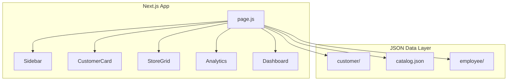
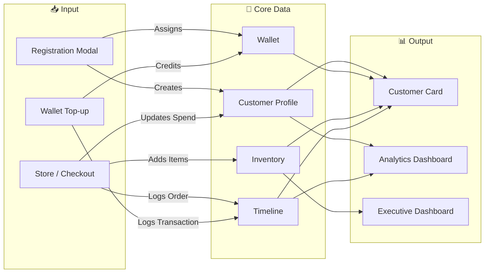
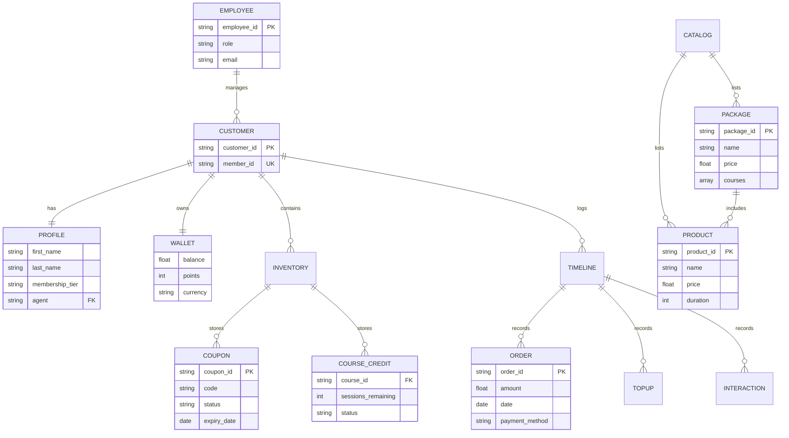

# V School CRM - System Overview

## Project Summary
A comprehensive Customer Relationship Management (CRM) system built with **Next.js** for **V School** (Japanese Culinary Academy). The system provides a 360° view of customer engagement, sales, inventory, and analytics.

---

## Architecture



---

## Data Flow Diagram



### Flow Description

| Flow | Trigger | Data Updated |
|------|---------|--------------|
| **Registration** | New Customer | `profile.json` created, `member_id` assigned |
| **Purchase** | Checkout | `inventory` + `timeline` + `total_spend` |
| **Top-up** | Wallet Credit | `wallet.balance` + `timeline` |
| **Analytics** | Page Load | Reads all `profile.json` files |

---

## Core Modules

| Module | File | Purpose |
|--------|------|---------|
| **Customer 360** | `CustomerCard.js` | Profile, Wallet, Inventory, Timeline |
| **Store** | `StoreGrid.js`, `ProductModal.js` | Course & Package Sales |
| **Analytics** | `Analytics.js` | 8-Tab Dashboard (Sales, CLV, Funnel, etc.) |
| **Dashboard** | `Dashboard.js` | Executive KPIs |
| **Auth** | `LoginPage.js` | Role-based Login |

---

## Entity Relationship Diagram (ERD)



---

## Data Schema

### Customer Profile (`profile_cXXX.json`)
```json
{
  "customer_id": "c001",
  "profile": {
    "member_id": "MEM-2024-0001",  // NEW
    "first_name": "...",
    "membership_tier": "GOLD"
  },
  "wallet": { "balance": 500, "points": 600 },
  "inventory": { "coupons": [], "learning_courses": [] },
  "timeline": []
}
```

### ID System
| ID Type | Format | Example | Purpose |
|---------|--------|---------|---------|
| Customer ID | `cXXX` | `c001` | Internal System Key |
| **Member ID** | `MEM-YYYY-XXXX` | `MEM-2024-0001` | Customer-Facing ID |
| Course ID | `TVS-FC-XXX` | `TVS-FC-SUSHI-01` | Product Catalog |
| Package ID | `TVS-PKG-XXX` | `TVS-PKG-STARTER` | Bundle Catalog |

---

## Analytics Dashboard (8 Tabs)

1.  **Market & Sales**: Revenue, Orders, Best-Sellers
2.  **Customer & CLV**: ABC Analysis, RFM Segmentation
3.  **Financial Overview**: P&L (Estimated COGS)
4.  **Lead Funnel**: Inquiry → Close Rate
5.  **Retention & Follow-up**: Churn Risk, Expiry Alerts
6.  **Channel ROI**: Ad Spend vs. ROAS
7.  **Event Analytics**: Openhouse Performance
8.  **Campaign Tracker**: Budget, Spend, Revenue per Campaign

---

## Key Integrations (Current Status)

| System A | System B | Status |
|----------|----------|--------|
| Registration | Member ID | ✅ Integrated |
| Store Checkout | Inventory | ✅ Integrated |
| Orders | Timeline | ✅ Integrated |
| Analytics (RFM) | Customer Data | ✅ Integrated |
| Analytics (ROI) | Real Data | ⏳ Mock Data |
| Wallet Top-up | Transaction Log | ⏳ UI Only |

---

## File Structure (Key Paths)

```
/Users/ideab/Desktop/data_hub/
├── crm-app/
│   └── src/
│       ├── app/page.js          # Main Entry
│       └── components/
│           ├── Analytics.js
│           ├── CustomerCard.js
│           ├── StoreGrid.js
│           └── ...
├── customer/
│   ├── c001/profile_c001.json
│   └── ...
├── catalog.json                 # Products & Packages
└── employee/                    # Staff Profiles
```

---
data_hub/ (Root Directory)
├── 📁 customer/           <-- 📦 ฐานข้อมูลลูกค้า (JSON)
│   ├── 📁 c001/ 
│   │   └── profile_c001.json
│   ├── 📁 c002/ ... (จนถึง c007)
│
├── 📁 products/           <-- 📚 ข้อมูลคอร์สเรียนและแพ็กเกจ
│   ├── 📁 courses/        (ไฟล์ JSON แยกรายวิชา)
│   └── 📁 packages/       (ไฟล์ JSON รายแพ็กเกจ)
│
├── 📁 employee/           <-- 👥 ข้อมูลพนักงาน (เซลล์/แอดมิน)
│   ├── 📁 em01/ 
│   │   └── profile_e01.json
│
├── 📁 crm-app/            <-- 🌐 ตัวระบบหลัก (Next.js Application)
│   ├── 📁 src/
│   │   ├── 📁 app/
│   │   │   ├── 📁 api/    <-- ⚡ [NEW] ส่วน Backend ที่ผมสร้างเพิ่ม
│   │   │   │   └── 📁 customers/
│   │   │   │       ├── route.js      (จัดการรายชื่อทั้งหมด)
│   │   │   │       └── 📁 [id]/
│   │   │   │           └── route.js  (บันทึกข้อมูลลูกค้ารายคน)
│   │   │   └── page.js    (หน้าเว็บหลักที่รวมทุกอย่าง)
│   │   └── 📁 components/ <-- 🧩 ชิ้นส่วน UI (Analytics, Dashboard, etc.)
│   ├── 📁 public/
│   │   └── 📁 data/
│   │       └── marketing.json  <-- 📊 [NEW] ไฟล์ตั้งค่าแคมเปญและงบประมาณ
│   └── package.json
│
├── 📄 catalog.json        <-- 📋 ไฟล์แคตตาล็อกสินค้าหลัก
└── 📄 รันระบบ_NextJS.command <-- 🚀 สคริปต์สำหรับเปิดโปรแกรม

## Running the Application

```bash
cd /Users/ideab/Desktop/data_hub/crm-app
npm run dev
# Access at http://localhost:3000
# Login: admin@vschool.co.th / admin123
```
